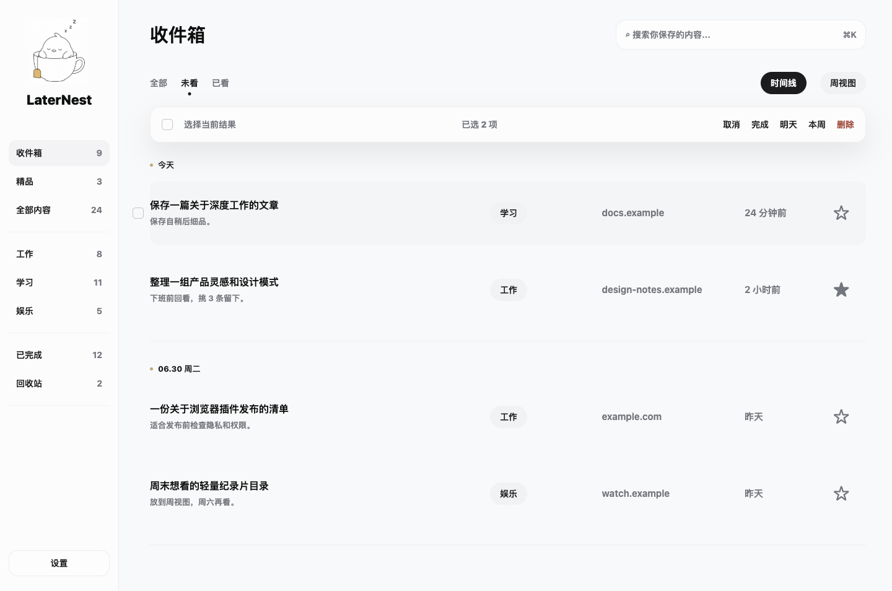

# LaterNest / 稍后细品

一个本地优先的 Chrome 稍后阅读工作台，把值得稍后看的网页带回真正会整理和阅读的地方。

A local-first Chrome read-later workspace that turns saved links into a calm, reviewable queue.

[中文](#中文介绍) · [English](#english)

## 中文介绍

我们每天都会遇到太多“值得之后再看”的内容。

问题不是不会收藏，而是收藏之后它们很快变成另一个被遗忘的角落。浏览器收藏夹太重，聊天窗口转发太散，传统稍后读工具又常常把“保存”做得很轻，把“回来整理”做得不够自然。

**稍后细品 LaterNest** 想解决的是这个小而真实的问题：把网页先放进一个安静的收件箱，再在合适的时间重新整理、回看、完成。

### 它能做什么

- 快速保存当前网页标题、URL、来源域名、备注、分类和待看时间。
- 支持工作、学习、娱乐三类组织。
- 用时间线视图按日期回看内容。
- 用周视图整理一周内积累的链接。
- 支持搜索、筛选、收藏、完成、延后、恢复和删除。
- 支持批量操作，快速清理积压链接。
- 可选配置 Feishu/Lark Webhook，把未看清单发送到你自己的机器人。

### 隐私优先

LaterNest 没有账号系统，也没有后台服务器。

默认情况下，你保存的链接和设置都只保存在自己的 Chrome 浏览器里，通过 `chrome.storage.local` 存储。

只有当你主动在设置页配置 Feishu/Lark Webhook 时，LaterNest 才会把未看链接发送到你自己的机器人。Webhook URL 也只保存在你的本地浏览器里，不会发送给这个仓库的维护者。

完整隐私说明见 [PRIVACY.md](./PRIVACY.md)。

### 从源码安装

1. 下载或 clone 这个仓库。
2. 打开 Chrome，进入 `chrome://extensions/`。
3. 开启右上角 **Developer mode / 开发者模式**。
4. 点击 **Load unpacked / 加载已解压的扩展程序**。
5. 选择这个仓库文件夹。

Chrome 会把 LaterNest 作为本地扩展加载。

### 权限说明

LaterNest 请求以下权限：

- `tabs`：保存页面时读取当前标签页标题和 URL。
- `storage`：把链接和设置存到 Chrome 本地存储。
- `alarms`：创建提醒和可选的每日同步任务。
- `notifications`：显示本地提醒通知。
- `host_permissions` for `https://open.feishu.cn/*`：在你配置 Webhook 后，请求你自己的 Feishu/Lark 机器人。

---

## English

LaterNest is a local-first Chrome extension for saving web pages into a calm, reviewable reading queue.

It is designed for people who collect useful links throughout the day but want a cleaner way to return, triage, and actually read them later.

### What It Does

- Save the current tab with title, URL, domain, category, note, and reminder time.
- Organize saved links by Work, Study, and Fun.
- Review saved links in a lightweight Timeline view.
- Use Week View to organize what accumulated during the week.
- Search, filter, favorite, complete, postpone, restore, and delete links.
- Use bulk actions to clean up multiple links at once.
- Optionally send pending links to your own Feishu/Lark webhook.

### Privacy First

LaterNest does not run a backend server and does not include an account system.

By default, saved links and settings stay in your browser through `chrome.storage.local`.

Optional Feishu/Lark sync only runs if you add your own webhook URL in the extension settings. That webhook URL is stored locally in your browser and is not sent to this repository owner.

Read the full privacy note in [PRIVACY.md](./PRIVACY.md).

### Install From Source

1. Download or clone this repository.
2. Open Chrome and visit `chrome://extensions/`.
3. Enable **Developer mode**.
4. Click **Load unpacked**.
5. Select this repository folder.

Chrome will load LaterNest as a local extension.

### Permissions

LaterNest requests these permissions:

- `tabs`: read the active tab title and URL when you save a page.
- `storage`: store todos and settings locally in Chrome.
- `alarms`: schedule reminders and optional daily sync.
- `notifications`: show local reminder notifications.
- `host_permissions` for `https://open.feishu.cn/*`: send data to your own Feishu/Lark webhook when configured.
